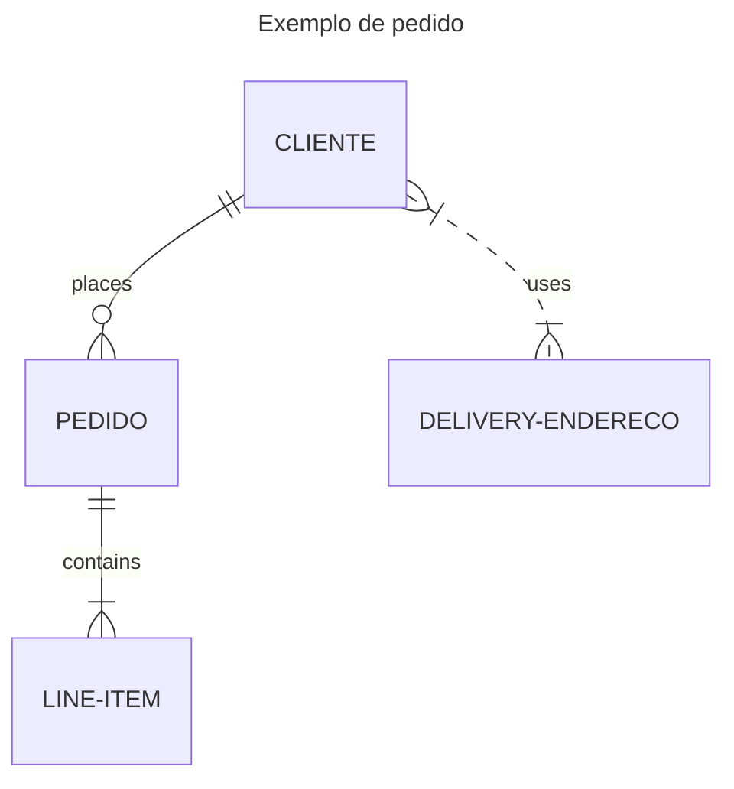

# Modelagem
Resumo sobre tipos de modelagem de banco de dados

*******
Tabelas de conteúdo 
 1. [Modelo Entidade Relacionamento](#mer)
 2. [Entidades](#ent)
 3. [Relacionamentos](#rel)
 4. [Cardinalidade](#card)
 5. [Atributos](#atributos)

*******

  

 
# Modelo de Entidade Relacionamento
Modelo conceitual que descreve as entidades e seus relacionamentos. 

 

 
# Entidades
Objeto do mundo real que tem importância para o sistema. 
### Entidade Forte
São as entidades que existem independentemente de outras entidades. 
### Entidade Fraca
São as entidades que dependem de outras entidades para sua existência. Elas não têm uma chave primária própria e usam a chave primária de outra entidade, juntamente com outros atributos, para formar sua chave primária.
### Entidade Associativa
São as entidades que são usadas para resolver relacionamentos muitos-para-muitos entre duas outras entidades. Elas contêm a chave primária de ambas as entidades envolvidas no relacionamento. 

 
  
# Relacionamentos
Os principais tipos de relacionamentos são:  
* **Relacionamento Um para Um (1:1):** Cada instância de uma entidade está associada a uma única instância de outra entidade.
* **Relacionamento Um para Muitos (1:N):** Uma única instância de uma entidade está associada a várias instâncias de outra entidade. 
* **Relacionamento Muitos para Muitos (M:N):** Várias instâncias de uma entidade estão associadas a várias instâncias de outra entidade. 

Os relacionamentos podem ser classificados com base no número de entidades envolvidas. Aqui estão os três graus de relacionamento:
1.	*Relacionamento Unário:* Este tipo de relacionamento envolve apenas uma entidade. 
2.	*Relacionamento Binário:* Este é o tipo mais comum de relacionamento e envolve duas entidades. 
3.	*Relacionamento Ternário:* Este tipo de relacionamento envolve três entidades.
4.	*Relacionamento N-ário:* Este tipo de relacionamento envolve três 4 ou mais entidades.

<!--Mais sintaxe e diagramas de exemplo [aqui](https://mermaid-js.github.io/)-->

 
  
# Cardinalidades
A cardinalidade ajuda a definir as regras do relacionamento entre as entidades e refere-se ao número de instâncias que uma entidade pode ter em um relacionamento. 
Existem quatro tipos principais de cardinalidade:
1.	**Um para Um (1:1):** Uma instância de uma entidade se relaciona com exatamente uma instância de outra entidade. 
2.	**Um para Muitos (1:N):** Uma instância de uma entidade se relaciona com várias instâncias de outra entidade. 
3.	**Muitos para Um (N:1):** Várias instâncias de uma entidade se relacionam com uma única instância de outra entidade. 
4.	**Muitos para Muitos (M:N):** Várias instâncias de uma entidade se relacionam com várias instâncias de outra entidade. 

 

# Atributos

São características ou propriedades que descrevem uma entidade ou um relacionamento. 

Classificação dos tipos de atributos

1.	**Quanto ao valor** 
*	*Atributo Multivalorado:* pode ter vários valores para a mesma entidade. Por exemplo, uma pessoa pode ter vários números de telefone.
*	*Atributo Monovalorado/único:* só podem assumir um único valor. Ex. nome.

2.	**Quanto a subdivisão**
* *Atributo Simples/ Atômico:* Não pode ser dividido em subpartes. Por exemplo, a idade de uma pessoa é um atributo simples.
*	*Atributo Composto:* Pode ser dividido em subpartes. Por exemplo, o endereço de uma pessoa é um atributo composto que pode ser dividido em rua, cidade, estado e CEP.

3.	**Quanto ao armazenamento**
*	*Atributo Armazenado:* o dado pode ser armazenado diretamente e não é originário de nenhum tratamento computacional. Exemplo data de nascimento.
*	*Atributo Derivado:* Seu valor é calculado a partir de outros atributos. Por exemplo, a idade de uma pessoa pode ser derivada de sua data de nascimento.

**Atributo Chave:** Identifica exclusivamente uma entidade em um conjunto de entidades. Por exemplo, o número da Segurança Social pode ser usado como um atributo chave para a entidade Pessoa.

## DER - Diagrama Entidade Relacionamento
Ferramenta - BrModelo

## MLD - Modelo Lógico de Dados 
Ferramenta - BrModelo

## MFD - Modelo Físico de Dados
Ferramenta - Power Architect

